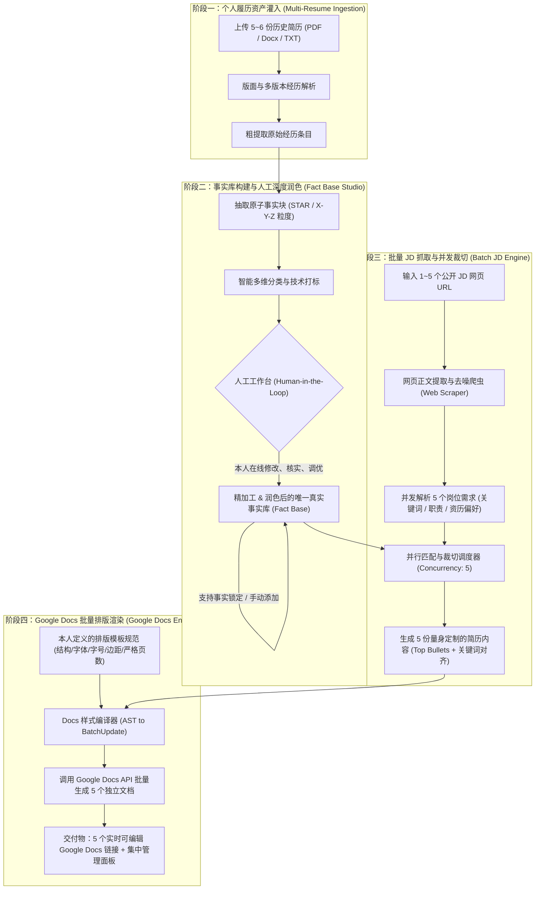

# AutoJobHunt & Resume Tailor - 产品需求文档 (PRD)

| 文档版本 | 状态 | 更新日期 | 定位与性质 | 目标用户 |
| :--- | :--- | :--- | :--- | :--- |
| **v1.1.0** | 待评审 (Ready for Review) | 2026-09-23 | **个人专属求职神器 (Solo Career Copilot)** | 个人专属使用，追求极致人机协同与投递效率 |

---

## 目录
1. [项目定位与核心目标](#1-项目定位与核心目标)
2. [个人专属原则与核心设计理念](#2-个人专属原则与核心设计理念)
3. [端到端业务全景流程图](#3-端到端业务全景流程图)
4. [核心功能模块详细需求 (PRD 核心)](#4-核心功能模块详细需求)
   - [4.1 历史多简历导入与结构化解析 (Multi-Resume Ingestion)](#41-历史多简历导入与结构化解析)
   - [4.2 事实库提取与人工深度编辑/润色工作台 (Fact Base & Human-in-the-Loop Studio)](#42-事实库提取与人工深度编辑润色工作台)
   - [4.3 事实分类加工与 X-Y-Z 提炼引擎 (Fact Refinement & Categorization)](#43-事实分类加工与-x-y-z-提炼引擎)
   - [4.4 批量公共 JD URL 输入与并发定制引擎 (Batch JD Ingestion & Parallel Tailoring)](#44-批量公共-jd-url-输入与并发定制引擎)
   - [4.5 用户完全定义的 Google Docs 模板与排版渲染引擎 (Google Docs Typography Engine)](#45-用户完全定义的-google-docs-模板与排版渲染引擎)
5. [系统技术架构与数据模型设计](#5-系统技术架构与数据模型设计)
6. [AI 护栏与防幻觉双重保障机制](#6-ai-护栏与防幻觉双重保障机制)
7. [Google Docs API 集成与批量导出方案](#7-google-docs-api-集成与批量导出方案)
8. [非功能性需求 (NFR)](#8-非功能性需求)
9. [MVP 路线图与实施规划](#9-mvp-路线图与实施规划)

---

## 1. 项目定位与核心目标

### 1.1 项目定位
本项目是一套**专为个人量身打造的私有化 AI 求职与智能简历定制系统 (Personal Career Copilot)**。它不面向公众做多租户 SaaS，不包含繁琐的计费和权限系统，而是专注于**个人极高的求职生产力、对事实履历的 100% 绝对掌控，以及对版面排版的像素级还原**。

### 1.2 核心目标与解决的实际场景
1. **聚合 5~6 份历史简历**：从过往不同方向（如全栈、后端、架构、管理、中英文版）的旧简历中，抽取完整的经历与成果，构建个人专属的“唯一真实事实资产库 (Source of Truth Fact Base)”。
2. **人机协同事实编辑与润色**：系统提取事实后，提供可视化工作台，**由本人亲自审阅、修改、补充细节、手动精细润色，并锁定核心事实**，确保所有内容 100% 真实且表述顶尖。
3. **批量 5 个 JD URL 并发定制**：找工作时，支持一次性喂入 **最多 5 个公共职位的网页链接 (Job Description URLs)**，系统自动抓取、清洗网页，同时并发为这 5 个岗位生成契合度最高的定制化简历。
4. **完全由我定义的 Google Docs 排版自动化**：从模块顺序、字体（如 Calibri/Arial）、各级字号、页边距、行间距到单页/两页约束，全由本人配置规则，系统自动调用 Google Docs API 批量生成 5 份开箱即用的专业 Google Docs。

---

## 2. 个人专属原则与核心设计理念

| 维度 | 设计理念 | 具体体现 |
| :--- | :--- | :--- |
| **产品性质** | **个人专属 (Solo Tool)** | 架构极简、私密安全，部署在本地或个人私有服务上，完全围绕本人的使用习惯和履历特点优化。 |
| **真实性控制** | **人机协同 (Human-in-the-Loop)** | AI 负责繁重的粗提炼，本人拥有最高控制权：提取出来的每条事实都可以手工在线修改、调优数字、重写动词、手动打标和永久锁定。 |
| **投递效率** | **批处理驱动 (Batch-First)** | 告别单个逐一生成的繁琐操作，一次性粘贴 5 个目标 JD 链接，后台并行调度，一键生成 5 份 Google Docs，5 倍提升海投效率。 |
| **视觉呈现** | **像素级排印 (Pixel-Perfect)** | 彻底告别传统 AI 工具粗糙的 Markdown 导出，严格按本人定义的排版层级、字号和边距直接注入 Google Docs，绝无“多出 2 行掉入下一页”的尴尬排版。 |

---

## 3. 端到端业务全景流程图



---

## 4. 核心功能模块详细需求

### 4.1 历史多简历导入与结构化解析
* **支持输入**：支持批量喂入 5~6 份历史简历（格式涵盖 PDF、Word `.docx`、Markdown 或 TXT）。
* **多版本经历聚合与对齐**：
  * 系统智能识别不同版本中的同一家公司、同一职务或同一段项目经历（例如 2022 年简历与 2024 年简历对同一项目的不同描述）。
  * 提取各版本的不同侧重描述，保留时间线主干，形成统一的时间轴总谱。

---

### 4.2 事实库提取与人工深度编辑/润色工作台 (Human-in-the-Loop Studio)
这是确保简历**100% 真实、极高水准**的核心枢纽。系统不仅依靠 AI 进行事实提取，还提供专门的可视化人工编辑界面：

#### A. 原子事实块标准字段 (Atomic Fact Unit)
从简历中抽取的最小事实单元包含：
* **所属机构与角色**：公司名称、职务、部门、时间区间（精确到年月）。
* **项目/上下文 (Context)**：负责的核心业务场景、面临的系统瓶颈或挑战。
* **行动与方法 (Action)**：本人主导的具体设计、架构决策、算法应用或工程手段。
* **量化成果 (Impact / Metrics)**：具体的收益（如延时下降 35%、成本节约 $200K、支撑 500 万 DAU）。
* **技术栈标签 (Tech Stack Tags)**：关联的工具与语言（如 `Golang`, `Kafka`, `ClickHouse`, `AWS EKS`）。

#### B. 人工审阅、在线修改与手工润色功能
* **内联富文本编辑 (Inline Edit)**：在工作台卡片中，本人可随时点击任意一段文字直接修改，纠正 AI 提取时的语义偏差或补充更精准的数据。
* **AI 辅助润色按钮与自由改写**：
  * 提供一键“强动词化 (Action-Verb Boost)”、一键“Google X-Y-Z 转换”功能，给出 2~3 个润色候选项；
  * 本人可自由挑选或在建议基础上进一步手工微调。
* **锁定保护机制 (Fact Lock)**：对已经人工润色到最满意的精选 Bullet Point，可打上“锁定”标记，后续任何 AI 自动化流程均不得更改其文字。
* **手动新增事实块**：支持在无原始简历对应的情况下，直接在界面上手动录入一段全新的工作成就，随时扩充事实库。
* **原始文本对照面板**：点击任意事实块，侧边栏联动高亮显示它在最初 5~6 份简历中对应位置的原句，方便溯源对比。

---

### 4.3 事实分类加工与 X-Y-Z 提炼引擎
* **多维度智能标签分类**：
  1. **职能方向**：后端开发、高并发架构、前端/全栈、数据工程/ML、DevOps/云原生、技术管理。
  2. **成就类型**：性能极致优化、从 0 到 1 架构研发、高可用与容灾保障、降本增效、团队带领与项目推进。
  3. **熟练度与权重评级**：本人可标记每条事实的推荐权重（⭐核心王牌项目 vs 普通维护经历）。
* **多版本变体自动衍生 (Variants)**：
  * 对关键项目自动生成：
    * *变体 A（深入技术底层架构）*：突出系统设计、底层优化与框架选型；
    * *变体 B（高商业价值与量化产出）*：突出业务增长、成本缩减与指标提升；
    * *变体 C（领导力与项目推动）*：突出跨团队协同、技术规范制定与导师指导。

---

### 4.4 批量公共 JD URL 输入与并发定制引擎
专门为提升求职投递效率设计，一次性支持最多 5 个岗位网页 URL 的批量处理：

#### A. 批量输入界面 (Batch Input Modal)
* 界面提供 5 个输入框，允许一次性粘贴 1~5 个公开的职位招聘网页链接（支持 LinkedIn、Indeed、Greenhouse、Lever、Workday、各大科技公司官网 career 页面等）。
* **容错与回退机制**：若某些网站存在强制登录拦截或反爬验证，输入框提供一键切换为“直接粘贴 JD 纯文本”备用方案，确保不阻断整体流程。

#### B. 网页自动化抓取与去噪清洗 (Web Scraper & Content Sanitizer)
* 后台利用 Headless 抓取或轻量 HTTP 解析，配合正文提取算法（Readability 规则），自动过滤网页头部导航栏、底部版权、推荐侧边栏及 Cookie 弹窗等噪声。
* 自动抽取出清洗后的标准字段：
  * **Company Name**（公司名称）
  * **Job Title**（职位名称，如 Senior Backend Engineer）
  * **Requirements / Qualifications**（硬性要求与技术栈）
  * **Responsibilities**（核心工作职责）
  * **Domain / Keywords**（行业属性与高频词）

#### C. 并发定制调度器 (Concurrency Tailoring Engine)
* **并发执行（Pool Size: 5）**：5 个 JD 任务并行推进，独立进行语义检索与事实挑选。
* **针对性裁切与组装**：
  * 依据每个 JD 的侧重点，从事实库中检索契合度最高的 Top Bullets；
  * 根据岗位需求自适应生成针对该职位的 2~3 句精准 **Professional Summary**；
  * **Skills 技能栏动态重组**：将该 JD 最看重的语言与框架置顶前置；
  * **严格控制篇幅**：依据 1 页（或 2 页）字数预算，合理分配经历占比，舍弃无关项目。
* **实时进度面板 (Batch Progress Dashboard)**：
  * 采用 5 张卡片并列展示当前各岗位的状态：
    `[JD 1: Stripe - Backend] -> 抓取完成 -> 匹配度 92% -> Docs 写入中`
    `[JD 2: Databricks - Platform] -> 抓取完成 -> 匹配度 88% -> 已完成 (点击打开)`
    `...`

---

### 4.5 用户完全定义的 Google Docs 模板与排版渲染引擎
排版美观度与格式一致性直接决定简历的专业度。本系统将排版规则完全交由本人配置：

#### A. 简历结构自定义配置 (Structure Definition)
本人可在网页后台通过拖拽直观调整模块的先后顺序与显示状态：
* `[Header / Contact Info]`：姓名、电话、邮箱、LinkedIn、GitHub、个人网站、城市/所在地
* `[Professional Summary]`：（可开启/关闭）
* `[Technical Skills]`：（可配置置于最前或最后）
* `[Work Experience / Professional Experience]`：（自定义标题文案）
* `[Selected Projects]`：（独立模块或并入工作经历）
* `[Education]`：学历、专业、院校、时间
* `[Certifications / Awards]`：（可选）

#### B. 排印与样式精准控制 (Typography & Styling Rules)
本人可对文档内的所有元素指定精确样式，系统将严格执行：
* **全文字体族 (Font Family)**：支持自由选择（如 Calibri, Arial, Times New Roman, Roboto, Garamond）。
* **各级字号与字重 (Font Sizes & Weights)**：
  * 候选人姓名：`18~22 pt, Bold`
  * 联系方式：`9~10 pt, Regular`，自定义分隔符（如 `•` 或 `|`）
  * 一级大标题 (Section Header)：`11~12 pt, Bold, 全部大写 (ALL CAPS)`，可配置是否带底部细实线分割线
  * 公司名称与职位行：`10~11 pt`，公司名加粗，职位斜体，时间与地点靠右对齐
  * 正文与 Bullet Points：`9.5~10 pt, Regular`
* **间距与版面参数 (Margins & Spacing)**：
  * 纸张尺寸：标准 US Letter 或 A4
  * 页边距：上下左右均可自定义（推荐 0.5 英寸 / 36pt ~ 0.75 英寸 / 54pt）
  * 行间距：标准 1.10 ~ 1.15
  * 段前与段后间距：标题前 6pt，标题后 3pt；Bullet 之间 2~3pt；悬挂缩进 14~18pt

#### C. 单页严格控制机制 (Page-Fit Guardian)
* 若用户选择“严格 1 页”模式，渲染引擎计算总行数，若发现超出 1~3 行落入第 2 页，自动在安全容差内依次触发微调：
  1. 段后间距由 3pt 微降为 2pt；
  2. 行距由 1.15 微调为 1.10；
  3. 上下边距由 0.6in 微调为 0.5in；
  4. 绝不在视觉上显得突兀，确保整洁收敛在 1 页纸内。

#### D. Google Docs 批量生成与交付
* 每次批量运行，系统在 Google Drive 中自动建档，自动命名规范：
  * `[日期]_[Company]_[JobTitle]_Resume.gdoc`
* 输出清单卡片：
  * 集中列出 5 个生成的 Google Docs 在线编辑超链接；
  * 提供“一键在浏览器打开全部 5 篇文档”按钮；
  * 提供一键将 5 篇文档打包导出下载为 PDF 的功能。

---

## 5. 系统技术架构与数据模型设计

### 5.1 架构简图 (面向个人部署与运行)

```
[前端 Web 控制台 (React / Next.js)]
   ├── 1. 简历上传与解析展示
   ├── 2. 事实库管理工作台 (Inline Edit / 锁定 / 变体查看)
   ├── 3. 批量 5-JD 输入与进度看板
   └── 4. Google Docs 排版与样式配置器
          │  REST / WebSocket
          ▼
[后端服务 (Python / FastAPI or Node.js)]
   ├── 履历解析器 (PyMuPDF / pdfplumber)
   ├── 网页抓取引擎 (Playwright / Readability / BeautifulSoup)
   ├── AI 定制编排器 (LLM Prompt Pipeline + 防幻觉校验器)
   ├── 本地轻量数据库 (SQLite / ChromaDB 向量库 / 本地 JSON)
   └── Google Docs 样式编译器 (Google Docs REST API v1)
```

### 5.2 核心数据实体设计 (Data Schema)

#### 1. 事实块实体 (`FactBlock`)
```json
{
  "id": "fact_001",
  "company": "Stripe",
  "role": "Senior Software Engineer",
  "date_range": "2022.04 - 2025.01",
  "category": "Backend / Infrastructure",
  "sub_category": "Performance Optimization",
  "raw_source_snippets": ["Optimized payment pipeline latency..."],
  "refined_text": "Architected and deployed a distributed payment ingestion pipeline in Go, reducing p99 latency by 35% across 10M daily transactions.",
  "variants": {
    "metric_focused": "Reduced API p99 latency by 35% and cut AWS infrastructure costs by $180K annually by redesigning the caching layer.",
    "architecture_focused": "Architected a distributed event-driven pipeline using Go and Apache Kafka, achieving 99.999% availability."
  },
  "tech_stack": ["Go", "Kafka", "AWS", "Redis"],
  "metrics": ["35% latency drop", "10M daily transactions"],
  "is_locked": true,
  "is_verified": true,
  "personal_notes": "面试重点强调缓存一致性方案"
}
```

#### 2. 用户模板配置实体 (`UserDocsTemplateConfig`)
```json
{
  "template_name": "My_Standard_OnePage_Template",
  "page_setup": {
    "size": "LETTER",
    "margin_top_pt": 36,
    "margin_bottom_pt": 36,
    "margin_left_pt": 36,
    "margin_right_pt": 36
  },
  "font_family": "Calibri",
  "styles": {
    "candidate_name": { "size_pt": 20, "bold": true, "align": "CENTER" },
    "contact_info": { "size_pt": 9.5, "bold": false, "align": "CENTER", "separator": " • " },
    "section_header": { "size_pt": 11, "bold": true, "all_caps": true, "has_bottom_border": true },
    "role_and_company": { "company_bold": true, "role_italic": true, "size_pt": 10.5 },
    "bullet_body": { "size_pt": 9.5, "line_spacing": 1.15, "space_below_pt": 2.5, "bullet_indent_pt": 14 }
  },
  "section_order": [
    "HEADER",
    "SUMMARY",
    "SKILLS",
    "WORK_EXPERIENCE",
    "SELECTED_PROJECTS",
    "EDUCATION"
  ],
  "strict_one_page": true
}
```

#### 3. 批量任务记录 (`BatchTailorJob`)
```json
{
  "batch_id": "batch_20260923_01",
  "total_urls": 5,
  "tasks": [
    {
      "task_index": 1,
      "source_url": "https://boards.greenhouse.io/stripe/jobs/123456",
      "company": "Stripe",
      "job_title": "Staff Backend Engineer",
      "status": "COMPLETED",
      "match_score": 93.5,
      "google_doc_id": "1A2B3C...",
      "google_doc_url": "https://docs.google.com/document/d/1A2B3C.../edit"
    }
  ]
}
```

---

## 6. AI 护栏与防幻觉双重保障机制

求职简历容不得任何编造。针对个人求职的高标准要求，设计专门的“四层防幻觉围墙”：
1. **真实事实围栏 (Strict Context Injection)**：在为目标岗位做定制生成时，Prompt 仅注入经过本人人工核对与锁定的事实库条目，严令禁止 AI 引入任何外部未提及的经历。
2. **数字与专有名词比对器 (Deterministic Entity Matcher)**：利用正则表达式与关键词比对，确保生成文案中出现的数字（如百分比、金额、QPS）和技术栈，均能在事实库中找到对应原词，杜绝“夸大放水”。
3. **人工一览核对 (Traceability Tag)**：生成的每条 Bullet Point 在前端都打上源头标签，本人一眼即能辨识“这是基于事实库的哪条经历派生而来的”。
4. **生成后立即自由微调**：无论是在网页端还是直接在生成的 Google Docs 中，本人拥有最后的修正权。

---

## 7. Google Docs API 集成与批量导出方案

### 7.1 认证与权限控制
* 采用个人 Google Cloud Console 项目申请的 OAuth 2.0 Client ID 或服务账号 (Service Account)。
* 仅需获取个人 Google Drive 创建和编辑文件权限。文档自动存放在个人 Drive 指定目录（如 `Google Drive/AutoJobHunt/`）。

### 7.2 批量文档生成流水线
针对输入的 5 个 URL，并发调用 Google Docs API 执行渲染：
1. **创建空白文档**：`drive.files.create` 命名为 `[日期]_[Company]_[JobTitle]_TailoredResume`。
2. **结构化指令编译**：将已挑选的事实内容与本人的模板配置合并，编译生成连续的 `BatchUpdate` 指令列表：
   * `UpdateDocumentStyleRequest`：应用上下左右边距与纸张尺寸。
   * `InsertTextRequest`：按层级顺序写入文字。
   * `UpdateTextStyleRequest`：设置每个文本片段的字体、字号、颜色、粗体、斜体。
   * `UpdateParagraphStyleRequest`：设置段落行距、段前段后距、项目符号悬挂缩进。
   * `InsertTableRequest` 或 `InsertHorizontalRuleRequest`：插入模块下方的精美细分割线。
3. **返回访问链接**：生成可直接打开编辑的 URL 列表。

---

## 8. 非功能性需求 (NFR)

* **数据私密性 (Privacy)**：
  * 所有历史简历文件、事实库条目、配置和目标 JD 均保存在个人本地磁盘或专属私有空间中，绝不上载到公共共享库。
  * 调用商用 LLM API（如 OpenAI / Claude / Gemini API）时，使用不保留数据用于训练的企业/开发者接口。
* **并发处理效率**：
  * 单次批量 5 个 JD URL 的抓取、分析、匹配、定制及 Google Docs 写入，整体端到端耗时控制在 **40~60 秒** 内全部完成。
* **网页抓取兼容性**：
  * 支持主流求职 ATS 系统（Greenhouse, Lever, Workday, BambooHR, LinkedIn 等）公开页面的自动文本抽取；
  * 提供一秒切换纯文本粘贴的手动降级方案。
* **排版精准度**：
  * 字体、字号、间距 100% 严格执行用户配置，绝无样式漂移。

---

## 9. MVP 路线图与实施规划

| 阶段 | 交付核心 | 关键交付物 |
| :--- | :--- | :--- |
| **Phase 1: 个人简历解析与事实库工作台** | 2 周 | • 批量上传 5~6 份简历并解析结构。<br>• 事实块抽取与分类打标。<br>• **事实库在线编辑工作台**（支持手工修改、锁定、变体查看与增加）。 |
| **Phase 2: 批量 JD URL 抓取与并发裁切** | 2 周 | • 5 个公共 JD URL 的批量输入界面与正文提取爬虫。<br>• 5 任务并发定制编排器与进度看板。<br>• 基于事实库的匹配与防幻觉检验。 |
| **Phase 3: 自定义 Google Docs 模板与批量渲染** | 1.5 周 | • 个人模板配置器（结构拖拽、字体、各级字号、边距、严格 1 页约束）。<br>• Google Docs API 批量创建与样式编译渲染。<br>• 集中交付面板（5 个 Google Doc 链接直达 + PDF 导出）。 |
| **Phase 4: 全流程个人联调与投递测试** | 0.5 周 | • 完整端到端实测：从 6 份旧简历到输入 5 个真实 JD 链接，1 分钟内拿到 5 份完美排版的 Google Docs。 |
