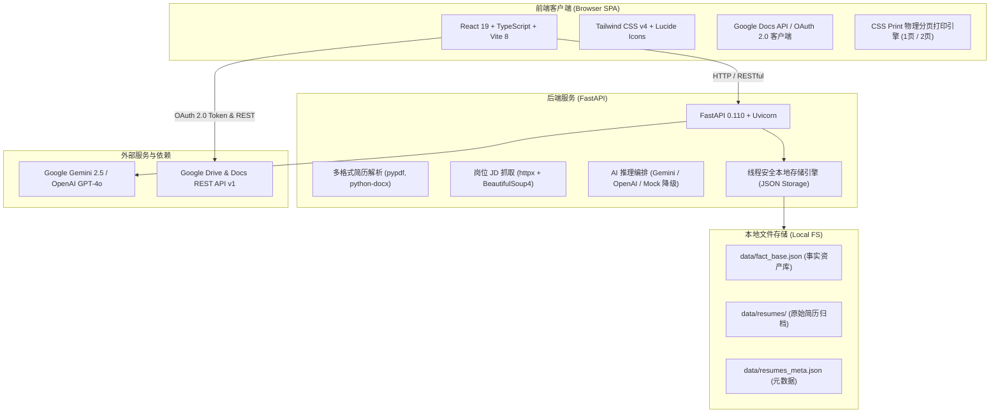

# AutoJobHunt & Resume Tailor — 系统技术栈文档 (Tech Stack)

| 文档版本 | 更新日期 | 系统定位 | 运行环境 |
| :--- | :--- | :--- | :--- |
| **v1.1.0** | 2026-09-24 | 个人专属私有化 AI 简历定制系统 (Solo Career Copilot) | Local-First / 单机本地运行 |

---

## 1. 总体架构概览

本项目采用 **前后端分离 (Decoupled SPA + RESTful API)** 与 **本地优先 (Local-First)** 架构，专为个人开发者的高效求职设计，具有高隐私性、零外部数据库依赖、人机协同（Human-in-the-Loop）与零幻觉防编造特点。



---

## 2. 前端技术栈 (Frontend Stack)

前端工程位于 [`frontend/`](file:///c:/Joy%20folder/autojobhunt/frontend) 目录，负责多简历上传交互、事实资产库可视化编辑/锁定、岗位 JD 抓取与匹配打分、双模态简历排版预览及 Google Docs 导出。

| 分类 | 技术选型 | 版本 | 核心作用与说明 |
| :--- | :--- | :--- | :--- |
| **核心框架** | [React](https://react.dev/) | `^19.3.0` | UI 视图层与组件化开发，利用 React 19 并发特性与现代 Hook 驱动状态管理 |
| **编程语言** | [TypeScript](https://www.typescriptlang.org/) | `~6.0.2` | 全局严格静态类型约束，保障事实块、简历元数据及匹配结果的数据安全 |
| **构建工具** | [Vite](https://vite.dev/) | `^8.3.0` | 基于原生 ESM 的极速本地开发服务器与 Rollup 生产构建 |
| **样式框架** | [Tailwind CSS](https://tailwindcss.com/) | `^4.3.3` | 新一代 Tailwind v4 引擎，基于 CSS 原生变量与 `@theme` 体系构建设计语言 |
| **CSS 预处理** | PostCSS + Autoprefixer | `^8.5.28` / `^10.6.1` | 处理现代 CSS 特性与浏览器前缀兼容 |
| **样式辅助工具** | `clsx` + `tailwind-merge` | `^2.1.1` / `^3.7.0` | 条件类名拼接与 Tailwind 类名冲突安全合并 |
| **图标库** | [Lucide React](https://lucide.dev/) | `^1.47.0` | 现代化矢量图标库（状态指示、锁定徽标、文件类型、操作按钮） |
| **排版与打印引擎** | 原生 CSS `@media print` | - | 严格支持 A4 / Letter 规格的单页（9 Bullets）与双页物理分页控制，杜绝文字跨页截断 |
| **第三方直连** | Google Identity Services + Google Docs API v1 | REST / JS SDK | 前端通过 OAuth 2.0 获取 Scope 权限后直接批量向用户 Google Drive 创建 Docs |

### 前端主要功能模块结构
- [`frontend/src/components/FactStudio.tsx`](file:///c:/Joy%20folder/autojobhunt/frontend/src/components/FactStudio.tsx): 个人履历真实事实资产库管理平台，多维分类筛选、统计面板。
- [`frontend/src/components/FactCard.tsx`](file:///c:/Joy%20folder/autojobhunt/frontend/src/components/FactCard.tsx): 事实原子卡片，支持即时内联点击编辑、一键锁定（Lock）、STAR/X-Y-Z 变体切换。
- [`frontend/src/components/ResumeTailorStudio.tsx`](file:///c:/Joy%20folder/autojobhunt/frontend/src/components/ResumeTailorStudio.tsx): 职位链接抓取、ATS 匹配打分、1 页精简版与 2 页详尽版即时预览。
- [`frontend/src/components/GoogleDocsExportModal.tsx`](file:///c:/Joy%20folder/autojobhunt/frontend/src/components/GoogleDocsExportModal.tsx): 样式模板选择与 Google Docs 自动化导出弹窗。
- [`frontend/src/services/googleDocsService.ts`](file:///c:/Joy%20folder/autojobhunt/frontend/src/services/googleDocsService.ts): 封装 Google Docs API 的 batchUpdate 结构化富文本与排版构造逻辑。

---

## 3. 后端技术栈 (Backend Stack)

后端工程位于 [`backend/`](file:///c:/Joy%20folder/autojobhunt/backend) 目录，采用轻量级、高并发的异步 API 设计。

| 分类 | 技术选型 | 版本 | 核心作用与说明 |
| :--- | :--- | :--- | :--- |
| **运行时环境** | Python | `>=3.11` | 现代 Python 运行时，支持强类型提示与异步 I/O |
| **Web 核心框架** | [FastAPI](https://fastapi.tiangolo.com/) | `>=0.110.0` | 异步高性能 REST API 框架，自动生成 OpenAPI / Swagger 文档 |
| **ASGI 服务器** | [Uvicorn](https://www.uvicorn.org/) | `[standard]>=0.28.0` | 高性能异步服务器，支持热重载（Live Reload） |
| **数据建模与校验** | [Pydantic v2](https://docs.pydantic.dev/) | `>=2.6.0` | 声明式数据模式校验、类型转换与高效序列化 |
| **配置管理** | `pydantic-settings` + `python-dotenv` | `>=2.2.0` / `>=1.0.1` | 读取并校验 `.env` 环境变量（LLM Provider、API Keys、端口等） |
| **PDF 解析引擎** | [pypdf](https://pypdf.readthedocs.io/) | `>=4.1.0` | 纯 Python 轻量 PDF 文本与段落提取 |
| **Word 解析引擎** | [python-docx](https://python-docx.readthedocs.io/) | `>=1.1.0` | 结构化解析 `.docx` 格式简历的段落、标题与表格 |
| **网络请求库** | [httpx](https://www.python-httpx.org/) | `>=0.27.0` | 异步/同步 HTTP 客户端，用于抓取目标岗位公开招聘网页 |
| **HTML 内容提取** | [BeautifulSoup4](https://www.crummy.com/software/BeautifulSoup/) | `>=4.12.0` | 解析与清洗招聘网站 DOM 树，提取岗位职责与技能要求 |
| **文件上传支持** | `python-multipart` | `>=0.0.9` | 流式处理多简历批量上传（PDF/DOCX/TXT） |

### 后端主要服务与接口分层
- [`backend/app/main.py`](file:///c:/Joy%20folder/autojobhunt/backend/app/main.py): FastAPI 入口应用，CORS 配置，统计 API `/api/stats`。
- [`backend/app/api/resumes.py`](file:///c:/Joy%20folder/autojobhunt/backend/app/api/resumes.py): 简历上传解析、历史简历列表管理 `/api/resumes`。
- [`backend/app/api/facts.py`](file:///c:/Joy%20folder/autojobhunt/backend/app/api/facts.py): 事实库增删改查、锁定、变体生成 `/api/facts`。
- [`backend/app/api/tailor.py`](file:///c:/Joy%20folder/autojobhunt/backend/app/api/tailor.py): 公开 JD 链接抓取 `/api/tailor/parse-url` 与简历定制生成 `/api/tailor/generate`。
- [`backend/app/services/fact_extractor.py`](file:///c:/Joy%20folder/autojobhunt/backend/app/services/fact_extractor.py): 聚合多份简历文本并调用 LLM/规则引擎提取标准化事实块。
- [`backend/app/services/tailor_service.py`](file:///c:/Joy%20folder/autojobhunt/backend/app/services/tailor_service.py): 岗位关键词匹配、契合度打分（Fit Score）与智能组装。
- [`backend/app/services/storage_service.py`](file:///c:/Joy%20folder/autojobhunt/backend/app/services/storage_service.py): 线程安全的本地 JSON 存储引擎。

---

## 4. AI 与大语言模型技术栈 (LLM & AI Engine)

系统实现了多模型适配器模式与无 Key 智能降级方案：

| 模块 | 技术选型 | 支持模型 / 实现 | 说明 |
| :--- | :--- | :--- | :--- |
| **Google GenAI** | `google-genai` (`>=0.1.1`) | `gemini-2.5-flash` / `gemini-1.5-flash` | Google 新一代官方 GenAI SDK，用于结构化提取与语义裁剪 |
| **OpenAI** | `openai` (`>=1.14.0`) | `gpt-4o` / `gpt-4o-mini` | OpenAI 官方客户端，备选 LLM 引擎 |
| **结构化输出** | JSON Schema / Response MIME | `application/json` 强约束 | 确保事实块、X-Y-Z 变体、ATS 评分稳定解析 |
| **Mock 降级引擎** | 内置规则仿真引擎 | 本地预制原子事实与精准组装 | 当未配置 API Key 时系统依然保持 100% 可用与交互体验 |
| **防幻觉机制** | Grounding Fact Guardrail | 强制比对事实库 ID 与锁定标记 | AI 仅允许润色表述，严禁凭空新增未经证实的经历或公司 |

---

## 5. 数据存储与持久化 (Data & Persistence)

为贯彻 **个人专属、私密本地** 的设计理念，项目不引入复杂笨重的外部数据库（如 MySQL/PostgreSQL），而是采用 **Local-First 文件持久化**：

```text
data/
├── resumes/                 # 用户上传的原始简历文件归档 (PDF / DOCX / TXT)
├── fact_base.json           # 核心资产：个人唯一真实事实库 (JSON Schema: FactBlock[])
├── resumes_meta.json        # 上传履历的元数据记录 (文件名、解析时间、大小等)
└── tailored_google_*.json   # 已生成的定制版简历缓存与归档
```

- **并发控制**：后端使用 Python 内置 `threading.Lock()` 实现原子读写，防止高并发下文件损坏。
- **便携备份**：整个 `data/` 目录只需打包即可完整迁移个人职业数据资产。

---

## 6. 外部服务与协同集成 (Integrations)

1. **Google Identity Services (GIS)**
   - 采用标准 OAuth 2.0 Authorization Code / Implicit Token 方案。
   - 申请 `https://www.googleapis.com/auth/documents` 与 `drive.file` 权限。
2. **Google Docs API v1**
   - 通过 `documents.create` 创建在线文档。
   - 通过 `batchUpdate` 批量提交富文本插入、字体设置（Calibri / Arial）、字号阶梯、段落间距等结构化命令，直接交付排版完美的文档。
3. **招聘站点解析器**
   - 针对常见 ATS 招聘系统（Greenhouse, Lever, Workday, Google Careers 等）及任意公共 JD 网页进行智能正文抽取与清洗。

---

## 7. 运行与工程运维 (DevOps & Tooling)

- **一键运行脚本**：根目录提供 [`start.bat`](file:///c:/Joy%20folder/autojobhunt/start.bat)，在 Windows 环境下一键同时启动 FastAPI（Port 8000）与 Vite 前端（Port 5173），并在启动 3 秒后自动弹出默认浏览器。
- **虚拟环境隔离**：后端自带专用独立 `backend/venv` 环境，杜绝全局依赖污染。
- **跨平台支持**：支持 Windows / macOS / Linux 命令行手动启动。
